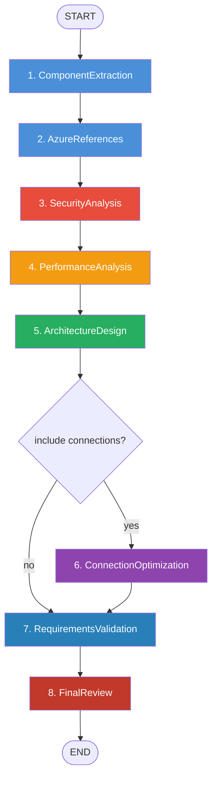
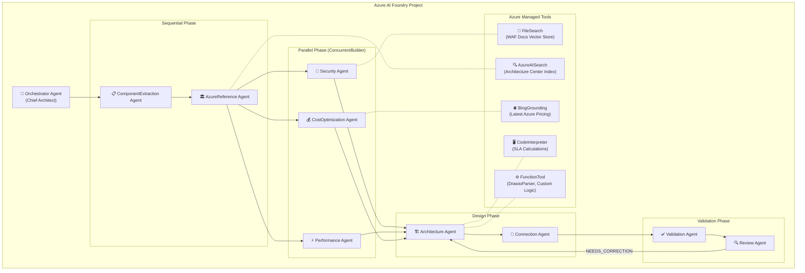

# Migrating LangGraph Agents to Azure AI Agent Service (Azure AI Foundry)

## Background & Problem

Your codebase (`architecture-Backend/`) implements a **9-agent LangGraph workflow** that generates and validates Azure architectures. The agents run locally via a Python FastAPI process with in-memory state (`MemorySaver`). You want to move this into **Azure AI Studio / Azure AI Foundry** so the agents are cloud-hosted, observable, and integrated with Azure's managed tooling.

---

## Your Current Agent Inventory

| # | Agent | File | Role |
|---|-------|------|------|
| 1 | `ComponentExtractionAgent` | [`agents/components.py`](file:///c:/Users/Agentassist/Desktop/azure-ai-arc-master/architecture-Backend/agents/components.py) | Decomposes requirements → APIs, NFRs, tech stack |
| 2 | `AzureArchitectureReferenceAgent` | [`agents/references.py`](file:///c:/Users/Agentassist/Desktop/azure-ai-arc-master/architecture-Backend/agents/references.py) | Maps to 100+ Azure Architecture Center patterns |
| 3 | `SecurityAgent` | [`agents/security.py`](file:///c:/Users/Agentassist/Desktop/azure-ai-arc-master/architecture-Backend/agents/security.py) | Zero Trust, STRIDE, compliance (SOC2/HIPAA/PCI) |
| 4 | `PerformanceAgent` | [`agents/performance.py`](file:///c:/Users/Agentassist/Desktop/azure-ai-arc-master/architecture-Backend/agents/performance.py) | Scaling, caching, latency optimization |
| 5 | `CostOptimizationAgent` | [`agents/cost.py`](file:///c:/Users/Agentassist/Desktop/azure-ai-arc-master/architecture-Backend/agents/cost.py) | FinOps, Reserved Instances, rightsizing |
| 6 | `ArchitectureAgent` | [`agents/architecture.py`](file:///c:/Users/Agentassist/Desktop/azure-ai-arc-master/architecture-Backend/agents/architecture.py) | Designs full Azure topology (layers, RGs, subnets) |
| 7 | `ConnectionExpertAgent` | [`agents/connection.py`](file:///c:/Users/Agentassist/Desktop/azure-ai-arc-master/architecture-Backend/agents/connection.py) | Validates/fixes service flow topology |
| 8 | `RequirementsValidationAgent` | [`agents/validation.py`](file:///c:/Users/Agentassist/Desktop/azure-ai-arc-master/architecture-Backend/agents/validation.py) | 100% coverage check + remediation actions |
| 9 | `AzureArchitectureReviewAgent` | [`agents/review.py`](file:///c:/Users/Agentassist/Desktop/azure-ai-arc-master/architecture-Backend/agents/review.py) | WAF 5-pillar assessment + iterative correction |

### Current LangGraph Workflow Topology



---

## Migration Strategy: Two Paths

> [!IMPORTANT]
> **We recommend a phased approach**: Start with **Path 1** (quick win, ~1 day) to get into Azure AI Foundry immediately, then incrementally adopt **Path 2** (native agents) for deeper integration.

### Comparison Matrix

| Dimension | Path 1: Foundry Hosted Agent | Path 2: Native Azure AI Agents |
|-----------|------------------------------|-------------------------------|
| **Effort** | ~1 day | 3–5 days |
| **Code changes** | Minimal — wrap existing graph | Major — rewrite each agent as Azure AI Agent |
| **State storage** | In-memory / Redis | Azure-managed Threads (built-in) |
| **Tools** | Existing Python tools | Azure managed tools (Code Interpreter, File Search, AI Search, Bing, OpenAPI) |
| **Multi-agent orchestration** | LangGraph graph (unchanged) | Connected Agents / Microsoft Agent Framework |
| **Observability** | OpenTelemetry → App Insights | Native Foundry tracing + App Insights |
| **Best for** | Fast migration, keep existing logic | Full Azure-native, long-term architecture |

---

## Path 1: Quick-Win — Host LangGraph in Azure AI Foundry

This approach keeps your existing [`langgraph_workflow.py`](file:///c:/Users/Agentassist/Desktop/azure-ai-arc-master/architecture-Backend/langgraph_workflow.py) **completely intact** and wraps it in a Foundry-compatible container.

### Step 1: Install Dependencies

```bash
pip install -U "langchain-azure-ai[hosting,opentelemetry,tools]" azure-identity
```

### Step 2: Create Hosting Entry Point

```python
# azure_hosted_agent.py (NEW FILE)
from langchain_azure_ai.agents.hosting import LangGraphResponsesHost
from langgraph_workflow import LangGraphWorkflow

# Compile your existing LangGraph workflow
workflow = LangGraphWorkflow()
compiled_graph = workflow.graph

# Wrap in Azure AI Foundry Responses protocol host
host = LangGraphResponsesHost(graph=compiled_graph)

if __name__ == "__main__":
    host.run(port=8080)
```

### Step 3: Containerize

```dockerfile
FROM python:3.11-slim
WORKDIR /app
COPY requirements.txt .
RUN pip install -r requirements.txt
COPY . .
EXPOSE 8080
CMD ["python", "azure_hosted_agent.py"]
```

### Step 4: Deploy to Azure AI Foundry

```bash
# Push container to Azure Container Registry
az acr build --registry <YOUR_ACR> --image arc-agent:v1 .

# Deploy as Foundry Hosted Agent via azd or Azure Portal
azd up
```

### What You Get
- ✅ Full Azure AI Studio observability (traces, logs, metrics)
- ✅ OpenTelemetry integration with Application Insights
- ✅ Entra ID authentication (automatic)
- ✅ `/responses` endpoint (OpenAI-compatible streaming)
- ✅ Zero changes to your agent logic

---

## Path 2: Full Native Migration to Azure AI Agent Service

> [!IMPORTANT]
> This is the recommended **long-term architecture**. Each LangGraph agent becomes a standalone Azure AI Agent with managed tools, and orchestration uses Connected Agents + Microsoft Agent Framework patterns.

### Target Architecture



---

### Step-by-Step Implementation

#### Step 1: Azure AI Foundry Project Setup

```python
# config/azure_ai_setup.py (NEW FILE)
import os
from azure.identity import DefaultAzureCredential
from azure.ai.projects import AIProjectClient

def get_project_client() -> AIProjectClient:
    """Initialize Azure AI Foundry project client."""
    return AIProjectClient.from_connection_string(
        credential=DefaultAzureCredential(),
        conn_str=os.environ["PROJECT_CONNECTION_STRING"]
    )
```

> [!NOTE]
> **Prerequisites**:
> 1. Create an Azure AI Foundry hub + project in Azure Portal
> 2. Deploy `gpt-4o` model in the project
> 3. Copy the Project Connection String from Overview page
> 4. Set environment variable: `PROJECT_CONNECTION_STRING`

---

#### Step 2: Upload Knowledge Base as Vector Stores

Your agents currently use `AzureDocsScanner` (local file index) and `DrawioReferenceAnalyzer`. Migrate these to Azure-managed **File Search** and **Azure AI Search**:

```python
# tools/knowledge_setup.py (NEW FILE)
from azure.ai.projects.models import FileSearchTool, FilePurpose

def setup_knowledge_stores(client):
    """Upload WAF docs, reference patterns, and architecture training data."""
    
    # 1. Upload Azure Architecture Center training data
    training_file = client.agents.upload_file_and_poll(
        file_path="./azure_architecture_training_data.json",
        purpose=FilePurpose.AGENTS
    )
    
    # 2. Upload any additional WAF / compliance docs from knowledge_base/
    # ... upload each file ...
    
    # 3. Create vector store
    vector_store = client.agents.vector_stores.create_and_poll(
        file_ids=[training_file.id],  # Add all file IDs
        name="azure-architecture-knowledge-base"
    )
    
    return vector_store
```

---

#### Step 3: Define Each Agent

Map each LangGraph agent to an Azure AI Agent with appropriate tools:

```python
# agents/azure_agents.py (NEW FILE)
from azure.ai.projects.models import (
    CodeInterpreterTool, FileSearchTool, FunctionTool,
    AzureAISearchTool, BingGroundingTool, ConnectedAgentTool, ToolSet
)

def create_all_agents(client, vector_store_id, search_connection_id):
    """Create all 9 specialist agents in Azure AI Agent Service."""
    
    # --- Shared Tools ---
    file_search = FileSearchTool(vector_store_ids=[vector_store_id])
    code_interpreter = CodeInterpreterTool()
    
    # --- 1. Component Extraction Agent ---
    component_agent = client.agents.create_agent(
        model="gpt-4o",
        name="ComponentExtractionAgent",
        instructions="""You are a Principal Requirements Analyst 📋.
        
        Decompose user requirements into structured categories:
        - REST/GraphQL/gRPC APIs
        - Non-Functional Requirements (SLA, throughput, latency)
        - Technical Requirements & Tech Stack
        - Business Requirements
        - Data Requirements (relational, NoSQL, volume)
        - Integration Points (external/legacy systems)
        - Resource Group boundary hints
        
        Recommend an initial architecture pattern.
        
        OUTPUT FORMAT: Respond with valid JSON containing keys:
        apis, nfrs, technical_requirements, tech_stack, 
        business_requirements, data_requirements, integration_points,
        recommended_architecture_pattern""",
        tools=file_search.definitions,
        tool_resources=file_search.resources
    )
    
    # --- 2. Azure Architecture Reference Agent ---
    reference_agent = client.agents.create_agent(
        model="gpt-4o",
        name="AzureArchitectureReferenceAgent",
        instructions="""You are a Principal Azure Reference Specialist 🏛️.
        
        Map extracted components to verified Azure Architecture Center 
        reference architectures. Use your File Search tool to find 
        matching patterns. Cover: Web, AKS Microservices, Serverless, 
        Big Data, IoT, AI/ML, Hub-Spoke, Zero Trust patterns.
        
        Recommend specific Azure services with citations.""",
        tools=file_search.definitions,
        tool_resources=file_search.resources
    )
    
    # --- 3. Security Agent ---
    security_agent = client.agents.create_agent(
        model="gpt-4o",
        name="SecurityAgent",
        instructions="""You are a Principal Security Architect 🔐.
        
        Implement Defense-in-Depth & Zero Trust principles:
        - STRIDE threat modeling
        - Identity: Entra ID, PIM, Conditional Access, Managed Identities
        - Network: WAF, Firewall, NSGs, Private Link, Bastion
        - Data: encryption at rest/in transit, Key Vault, CMK
        - Compliance: SOC2, HIPAA, GDPR, PCI-DSS, ISO 27001
        
        Output compliance_score and zero_trust_score (0-100).""",
        tools=file_search.definitions,
        tool_resources=file_search.resources
    )
    
    # --- 4. Performance Agent ---
    performance_agent = client.agents.create_agent(
        model="gpt-4o",
        name="PerformanceAgent",
        instructions="""You are a Principal Performance Engineer ⚡.
        
        Evaluate workload characteristics and design:
        - Latency targets (P50/P95/P99)
        - Horizontal/vertical scaling strategies
        - Caching (Redis Cache-Aside, CDN, Front Door)
        - Database optimizations (read replicas, CQRS)
        - Async patterns (Service Bus, Event Hubs, Event Grid)""",
        tools=file_search.definitions,
        tool_resources=file_search.resources
    )
    
    # --- 5. Cost Optimization Agent ---
    cost_agent = client.agents.create_agent(
        model="gpt-4o",
        name="CostOptimizationAgent",
        instructions="""You are a Principal Azure FinOps Architect 💰.
        
        Analyze architecture against FinOps principles:
        - Reserved Instances (1yr/3yr), Savings Plans, Spot VMs
        - Azure Hybrid Benefit (AHUB) licensing
        - Storage lifecycle tiering (Hot, Cool, Cold, Archive)
        - Compute rightsizing and serverless opportunities
        - Cost governance, budgets, and alerts""",
        tools=file_search.definitions + code_interpreter.definitions,
        tool_resources=file_search.resources
    )
    
    # --- 6. Architecture Agent (Core Designer) ---
    architecture_agent = client.agents.create_agent(
        model="gpt-4o",
        name="ArchitectureAgent",
        instructions="""You are a Principal Azure Solutions Architect 🏗️.
        
        Synthesize ALL upstream findings to design the full Azure topology:
        - Layer 0: Edge (Front Door, CDN, WAF)
        - Layer 1: Gateway (APIM, App Gateway, Load Balancer)
        - Layer 2: Compute & Integration (App Service, AKS, Functions, Logic Apps)
        - Layer 3: Data & Storage (SQL, Cosmos DB, Blob, Redis)
        - Layer -1: Cross-Cutting (Monitor, Key Vault, Entra ID, Log Analytics)
        
        Output JSON with: services[], connections[], containers[], 
        resource_groups[], architecture_pattern""",
        tools=file_search.definitions + code_interpreter.definitions,
        tool_resources=file_search.resources
    )
    
    # --- 7. Connection Expert Agent ---
    connection_agent = client.agents.create_agent(
        model="gpt-4o",
        name="ConnectionExpertAgent",
        instructions="""You are a Principal Integration Architect 🔗.
        
        Validate and optimize service connections:
        - Ensure top-to-bottom flow: Users → Edge → Gateway → Compute → Data
        - Inject "Users" entry point if missing
        - Detect and auto-connect orphan services
        - Remove duplicate edges
        - Assign semantic labels and protocols
        - Flag anti-patterns (reverse flows, layer skips)""",
        tools=code_interpreter.definitions
    )
    
    # --- 8. Requirements Validation Agent ---
    validation_agent = client.agents.create_agent(
        model="gpt-4o",
        name="RequirementsValidationAgent",
        instructions="""You are a Principal Quality Assurance Architect ✅.
        
        Verify that EVERY extracted API, NFR, and integration point is 
        implemented in the architecture. Check:
        - Multi-RG separation
        - Connection completeness
        - Best practice compliance
        
        Generate remediation_actions if gaps found:
        (add_service, add_connection, modify_service, add_container)""",
        tools=file_search.definitions,
        tool_resources=file_search.resources
    )
    
    # --- 9. Architecture Review Agent ---
    review_agent = client.agents.create_agent(
        model="gpt-4o",
        name="AzureArchitectureReviewAgent",
        instructions="""You are a Principal Architecture Reviewer 🔍.
        
        Evaluate the solution across all 5 Azure Well-Architected Framework pillars:
        1. Reliability
        2. Security  
        3. Cost Optimization
        4. Operational Excellence
        5. Performance Efficiency
        
        If issues found, set status to "NEEDS_CORRECTION" and generate 
        correction_tasks with target agent routing.
        Otherwise set status to "APPROVED".""",
        tools=file_search.definitions,
        tool_resources=file_search.resources
    )
    
    return {
        "component": component_agent,
        "reference": reference_agent,
        "security": security_agent,
        "performance": performance_agent,
        "cost": cost_agent,
        "architecture": architecture_agent,
        "connection": connection_agent,
        "validation": validation_agent,
        "review": review_agent
    }
```

---

#### Step 4: Build the Orchestrator with Connected Agents

```python
# workflow/orchestrator.py (NEW FILE)
from azure.ai.projects.models import ConnectedAgentTool

def create_orchestrator(client, agents: dict):
    """Create the master orchestrator that chains all specialist agents."""
    
    # Wrap each specialist as a ConnectedAgentTool
    tools = []
    for key, agent in agents.items():
        tool = ConnectedAgentTool(
            id=agent.id,
            name=f"run_{key}_analysis",
            description=f"Invoke the {agent.name} specialist agent."
        )
        tools.extend(tool.definitions)
    
    orchestrator = client.agents.create_agent(
        model="gpt-4o",
        name="ChiefArchitectOrchestrator",
        instructions="""You are the Chief Architect Orchestrator 🎯.
        
        You coordinate a team of 9 specialist agents to generate and validate
        Azure architectures. Follow this EXACT execution order:
        
        PHASE 1 - EXTRACTION (Sequential):
        1. run_component_analysis → Extract requirements
        2. run_reference_analysis → Match Azure reference patterns
        
        PHASE 2 - EVALUATION (Run all three, use outputs together):
        3. run_security_analysis → Security & compliance review
        4. run_performance_analysis → Performance & scaling review
        5. run_cost_analysis → Cost optimization review
        
        PHASE 3 - DESIGN (Sequential):
        6. run_architecture_analysis → Design the full topology
        7. run_connection_analysis → Validate & optimize connections
        
        PHASE 4 - VALIDATION (Sequential):
        8. run_validation_analysis → Requirements coverage check
        9. run_review_analysis → WAF 5-pillar final review
        
        CORRECTION LOOP:
        If the review agent returns "NEEDS_CORRECTION", take the 
        correction_tasks and re-invoke the architecture agent with 
        the fixes, then re-run validation and review. Max 2 iterations.
        
        Pass the accumulated context between phases as JSON.""",
        tools=tools
    )
    
    return orchestrator
```

---

#### Step 5: Run the Full Workflow

```python
# run_workflow.py (NEW FILE)
import os
from config.azure_ai_setup import get_project_client
from tools.knowledge_setup import setup_knowledge_stores
from agents.azure_agents import create_all_agents
from workflow.orchestrator import create_orchestrator

def run_architecture_generation(user_requirements: str):
    """Execute the full multi-agent architecture generation pipeline."""
    
    client = get_project_client()
    
    with client:
        # 1. Setup knowledge base
        vector_store = setup_knowledge_stores(client)
        
        # 2. Create all specialist agents
        agents = create_all_agents(
            client,
            vector_store_id=vector_store.id,
            search_connection_id=os.environ.get("SEARCH_CONNECTION_ID")
        )
        
        # 3. Create orchestrator
        orchestrator = create_orchestrator(client, agents)
        
        # 4. Create thread and send requirements
        thread = client.agents.create_thread()
        client.agents.create_message(
            thread_id=thread.id,
            role="user",
            content=user_requirements
        )
        
        # 5. Run with streaming
        stream = client.agents.create_stream(
            thread_id=thread.id,
            agent_id=orchestrator.id
        )
        
        final_output = ""
        with stream as s:
            for event in s:
                if event.event == "thread.message.delta":
                    for delta in event.data.delta.content:
                        if hasattr(delta, "text"):
                            print(delta.text.value, end="", flush=True)
                            final_output += delta.text.value
        
        # 6. Retrieve complete result
        messages = client.agents.list_messages(thread_id=thread.id)
        
        # 7. Cleanup (optional — agents persist for reuse)
        # for agent in agents.values():
        #     client.agents.delete_agent(agent.id)
        # client.agents.delete_agent(orchestrator.id)
        
        return final_output

if __name__ == "__main__":
    result = run_architecture_generation(
        "Build a HIPAA-compliant e-commerce portal with "
        "microservices on AKS, Cosmos DB, and real-time analytics."
    )
```

---

#### Step 6: Integrate with Your FastAPI Backend

Update [`app.py`](file:///c:/Users/Agentassist/Desktop/azure-ai-arc-master/architecture-Backend/app.py) to call the Azure AI workflow instead of the local LangGraph:

```python
# In app.py — replace the local workflow invocation
from run_workflow import run_architecture_generation

@app.post("/api/v1/validate")
async def validate_architecture(request: ValidationRequest):
    result = run_architecture_generation(request.requirements)
    return {"status": "success", "result": result}
```

---

## Agent-to-Tool Mapping for Azure AI

This table shows how each agent's **existing local tools** map to **Azure AI managed tools**:

| Current Tool | Used By | Azure AI Replacement | Benefit |
|-------------|---------|---------------------|---------|
| `AzureDocsScanner` (local file index) | All agents | `FileSearchTool` (managed vector store) | Auto-chunking, embedding, serverless RAG |
| `DrawioReferenceAnalyzer` (local patterns) | Reference Agent | `AzureAISearchTool` (hybrid search) | Enterprise-grade search with semantic ranking |
| Custom Python calculations | Architecture, Cost | `CodeInterpreterTool` (sandboxed Python) | Secure execution, no local compute needed |
| `SEARCH_AZURE_DOCS` | All agents | `BingGroundingTool` | Real-time web search with citations |
| `SEND_MESSAGE` / `RECEIVE_MESSAGES` (message bus) | Inter-agent comms | `ConnectedAgentTool` | Native agent-to-agent delegation |
| `REFLECT_ON_OUTPUT` (self-critique) | Security, Architecture | Model's built-in reasoning | Handled by model chain-of-thought |
| `DrawioParser` (XML parsing) | Architecture | `FunctionTool` (client-side) | Keep as custom function tool |

---

## Proposed New File Structure

```
architecture-Backend/
├── config/
│   └── azure_ai_setup.py          [NEW] — Foundry client initialization
├── tools/
│   ├── knowledge_setup.py         [NEW] — Vector store & file uploads
│   └── custom_functions.py        [NEW] — FunctionTool wrappers (DrawioParser, etc.)
├── agents/
│   ├── azure_agents.py            [NEW] — All 9 agent definitions for Azure AI
│   ├── components.py              [KEEP] — Reference for prompts/logic
│   ├── references.py              [KEEP]
│   ├── security.py                [KEEP]
│   ├── performance.py             [KEEP]
│   ├── cost.py                    [KEEP]
│   ├── architecture.py            [KEEP]
│   ├── connection.py              [KEEP]
│   ├── validation.py              [KEEP]
│   └── review.py                  [KEEP]
├── workflow/
│   └── orchestrator.py            [NEW] — Connected Agent orchestration
├── azure_hosted_agent.py          [NEW] — Path 1: LangGraph hosting wrapper
├── run_workflow.py                [NEW] — Path 2: Native workflow runner
├── langgraph_workflow.py          [KEEP] — Original (used by Path 1)
├── multi_agent_workflow.py        [KEEP] — Original reference
└── app.py                         [MODIFY] — Switch to Azure AI workflow calls
```

---

## Azure Prerequisites Checklist

- [ ] **Azure Subscription** with AI Services access
- [ ] **Azure AI Foundry Hub** — create in Azure Portal → "Azure AI Foundry"
- [ ] **Azure AI Foundry Project** — create under the hub
- [ ] **Deploy `gpt-4o` model** — in the project's Model Catalog → Deploy
- [ ] **Copy Project Connection String** — Project Overview page → set as `PROJECT_CONNECTION_STRING`
- [ ] **(Optional) Azure AI Search resource** — for `AzureAISearchTool`
- [ ] **(Optional) Bing Search resource** — for `BingGroundingTool`
- [ ] **(Optional) Azure Container Registry** — for Path 1 container deployment
- [ ] **Install SDK**: `pip install azure-ai-projects azure-identity`

---

## Verification Plan

### Automated Tests
```bash
# Test agent creation and basic invocation
python -m pytest tests/test_azure_agents.py -v

# Test full workflow end-to-end
python run_workflow.py
```

### Manual Verification
1. Verify all 9 agents appear in Azure AI Foundry Portal → Agents tab
2. Run a sample architecture generation and confirm all phases execute
3. Check Azure AI Foundry tracing dashboard for execution flow visualization
4. Verify streaming output works in the frontend
5. Test the correction loop (feed a deliberately incomplete architecture)

---

## Open Questions

> [!IMPORTANT]
> **Q1: Which migration path do you prefer to start with?**
> - **Path 1** (Quick win — host existing LangGraph as-is in Foundry) → ~1 day
> - **Path 2** (Full native migration to Azure AI Agents) → 3–5 days
> - **Both** (Path 1 first, then incrementally migrate to Path 2)

> [!IMPORTANT]
> **Q2: Do you already have an Azure AI Foundry project set up?**
> If not, we'll need to create the hub, project, and model deployment first.

> [!IMPORTANT]
> **Q3: Custom tools — should we keep `DrawioParser` and `AzureDocsScanner` as local `FunctionTool` wrappers, or fully replace them with Azure-managed tools (`FileSearchTool`, `AzureAISearchTool`)?**

> [!WARNING]
> **Q4: Your current agents use extensive system prompts with few-shot examples (especially `ArchitectureAgent`). Azure AI Agent Service has a ~256K context window for `gpt-4o`, but very large instructions may impact latency and cost. Should we keep full prompts or distill them?**

---

## Official References

| Resource | Link |
|----------|------|
| Azure AI Agent Service Overview | `https://learn.microsoft.com/azure/ai-services/agents/overview` |
| Python SDK Quickstart | `https://learn.microsoft.com/azure/ai-services/agents/quickstart?pivots=programming-language-python` |
| Connected Agents (Multi-Agent) | `https://learn.microsoft.com/azure/ai-services/agents/how-to/connected-agents` |
| LangGraph Hosting in Foundry | `https://python.langchain.com/docs/integrations/providers/azure_ai/` |
| Azure AI Agents Playbook (GitHub) | `https://github.com/Azure-Samples/azure-ai-agents-playbook` |
| Multi-Agent Workshop (GitHub) | `https://github.com/Azure-Samples/multi-agent-workshop` |
| `azure-ai-projects` API Reference | `https://learn.microsoft.com/python/api/overview/azure/ai-projects-readme` |
